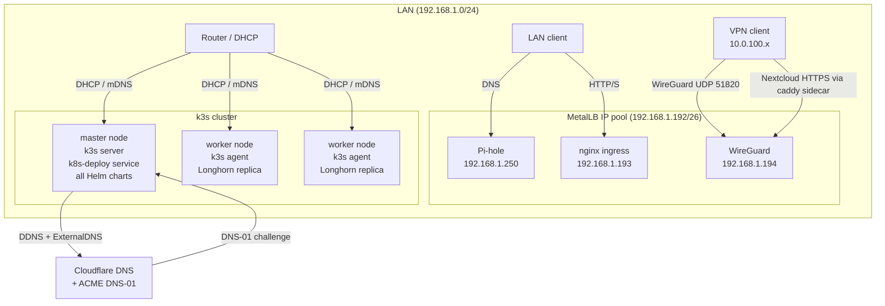
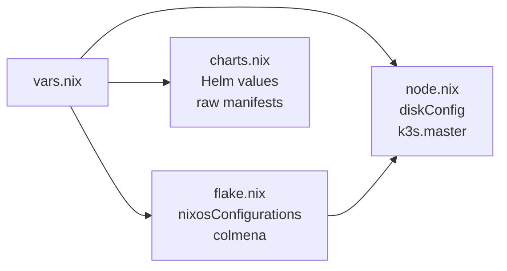

# Architecture

## Cluster topology

nixlab runs a [k3s](https://k3s.io/) cluster where nodes are divided into exactly one master and any number of workers. The master runs the k3s server process plus all Kubernetes workloads. Workers run k3s agent and contribute CPU, RAM, and disk (via Longhorn) to the cluster.



## How vars.nix flows through the system

`vars.nix` is a plain Nix attribute set. It is imported at three levels:

1. **`flake.nix`**: reads `vars.nodes` to build `nixosConfigurations` and the [Colmena](https://colmena.cli.rs/) deployment set. Each node becomes one configuration, using `node.hostname` as the NixOS hostname and `node.tags` as Colmena tags for targeted deploys.

2. **`modules/system/node.nix`**: receives `hostname` as a `specialArg` and looks up `vars.nodes.${hostname}` to set `diskConfig.device`, `diskConfig.espSize`, and the `master` flag for k3s.

3. **`modules/system/k8s/charts.nix`** and all service files under `k8s/services/` - import `vars.nix` directly and read `domain`, `metallbPool`, `piholeIp`, `wireguardIp`, `nginxIp`, `wireguardUsers`, and `upstreamDns` to populate Helm values and raw manifests.



Nothing else in the repo needs to be edited to configure the cluster. `vars.nix` is the single source of truth.

## Disk layout and impermanence

Each node's disk is partitioned with [Disko](https://github.com/nix-community/disko):

```
/dev/sdX (GPT)
├── boot   (1 MiB, BIOS boot)
├── ESP    (500 MiB, vfat, /boot)
└── root   (remainder, LVM PV)
    └── root_vg / root (LVM LV)
        └── btrfs
            ├── subvol /root     → /          (wiped on every boot)
            ├── subvol /persist  → /persist   (survives reboots)
            └── subvol /nix      → /nix       (Nix store, survives reboots)
```

During early boot, a systemd initrd service (`rollback`) runs before `/` is mounted:

1. Mounts the raw btrfs volume.
2. Renames the current `/root` subvolume to `/old_roots/<timestamp>`.
3. Creates a fresh empty `/root` subvolume.
4. Deletes `old_roots` entries older than 30 days.
5. Unmounts and lets the normal boot continue.

The result: every boot starts from a clean slate. Files written to `/` during a session vanish on the next reboot.

### What persists

The [impermanence](https://github.com/nix-community/impermanence) module (`modules/system/impermanence/default.nix`) bind-mounts selected paths from `/persist` into the fresh `/`:

**System state:**
- `/etc/nixos`, `/var/log`, `/var/lib/nixos` - NixOS metadata
- `/etc/NetworkManager/system-connections`, `/var/lib/NetworkManager` - network config
- `/var/lib/kubelet`, `/var/lib/rancher/k3s`, `/etc/rancher` - k3s state
- `/var/lib/longhorn`, `/var/lib/csi`, `/var/lib/docker` - storage
- `/etc/machine-id`, `/etc/adjtime` - stable machine identity

**SSH host keys** live at `/persist/etc/ssh/ssh_host_ed25519_key` and `ssh_host_rsa_key`. The `openssh` service is configured to use those paths so host key fingerprints don't change across reboots.

**User home directories:** `~/Code`, `~/Documents`, `~/.ssh`, `~/.gnupg`, `~/.config`, `~/.local` and `~/.config/sops` are persisted per-user.

**SOPS age key:** `/persist/etc/sops-nix/keys.txt` - the [age](https://github.com/FiloSottile/age) private key used to decrypt `secrets.yaml`.

## k3s module

`modules/system/k3s/default.nix` configures k3s based on `node.master`:

- **Master** (`master = true`): runs as `server` with `--cluster-init`, `--disable=servicelb`, `--disable=traefik`, `--disable=local-storage`. Writes kubeconfig to `/etc/rancher/k3s/k3s.yaml` (mode 0644 so the cluster user can read it).
- **Agent** (`master = false`): runs as `agent` and derives the master's URL from `vars.nodes` at build time - `serverAddr = "https://${masterHostname}:6443"`. No manual IP configuration needed.

Both roles use `config.sops.secrets.k3s_token.path` as the token file and run `openiscsi` (required by Longhorn).

The firewall is disabled cluster-wide (`mkForce false`) since k3s and MetalLB handle their own iptables rules. The host firewall interferes with CNI traffic.

## Kubernetes chart deployment

On the master node, a NixOS activation script (`kubernetes-prepare`) and a systemd service (`k8s-deploy`) handle all Kubernetes deployments.

**Activation script** (runs on every `nixos-rebuild switch` / `colmena apply`):
1. Writes rendered manifest YAML files to `/var/lib/kubernetes/manifests/`.
2. Clears deployment sentinel files (`/var/lib/kubernetes/.deploy-<group>-done`) for any group whose chart content changed (detected by comparing Nix store paths).
3. Restarts the `k8s-deploy` service.

**k8s-deploy service** (oneshot, runs after `k3s.service`):
1. Waits for the Kubernetes API to respond.
2. Creates all required namespaces.
3. Deletes all existing Jobs (to unblock re-runs).
4. Reads SOPS secrets and creates/patches Kubernetes Secret objects for credentials that services reference.
5. Deploys chart groups in dependency order, retrying each chart up to 3 times (configurable per group).
6. After each group succeeds, writes a sentinel file and waits for the declared readiness conditions before moving to the next group.
7. Runs the Nextcloud SSO setup script.

Deployment groups, in order:

| Group | Charts | Waits for |
|---|---|---|
| core-infrastructure | longhorn, metallb | longhorn-driver-deployer, metallb-controller |
| core-config | metallb-config | - (retries 5×) |
| networking-services | ingress-nginx, pihole | ingress-nginx-controller |
| dns-services | externaldns-pihole | external-dns |
| external-access | cert-manager | cert-manager deployment |
| external-dns | externaldns-cloudflare, cert-manager-issuers, cloudflare-ddns | external-dns |
| external-ingress | pihole-external-ingress | - |
| vpn-services | wireguard-config, wireguard-caddy-cert, wireguard-storage, wireguard-deployment, wireguard-service | wireguard deployment |
| apps | signal-proxy, nextcloud | signal-proxy, nextcloud deployments |

## SOPS secrets

All secrets live in `modules/system/sops/secrets.yaml`, encrypted with [SOPS](https://github.com/getsops/sops) + age. The key file location on running nodes is `/persist/etc/sops-nix/keys.txt`. [sops-nix](https://github.com/Mic92/sops-nix) decrypts secrets at activation time.

`modules/system/sops/default.nix` declares every secret and maps it to a file path that NixOS services can read. WireGuard user public keys are registered automatically by iterating over enabled entries in `vars.wireguardUsers` - each entry's `publicKeySecret` field becomes a SOPS secret name.

The Kubernetes deployment script reads decrypted secret paths from `config.sops.secrets.<name>.path` and pushes them into Kubernetes Secrets via `kubectl patch`.
